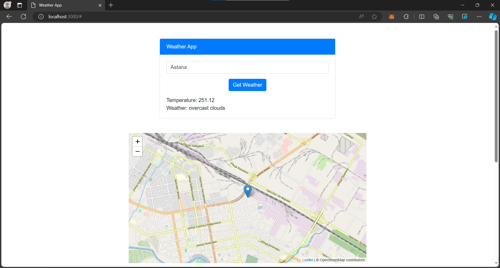

# Weather App

The Weather App is a simple web application that allows users to retrieve weather information for a specific city and generates an image related to the current weather conditions using the OpenAI DALL·E model. This README provides information on setting up and using the application.

## Table of Contents

- [Prerequisites](#prerequisites)
- [Installation](#installation)
- [Usage](#usage)
- [APIs Used](#apis-used)
- [Design Decisions](#design-decisions))

## Prerequisites

Before you begin, ensure you have met the following requirements:

- Node.js and npm installed on your local machine.
- OpenAI API key and OpenWeatherMap API key. You can obtain these by signing up on their respective websites.

## Installation

1. Unzip the folder of project
2. Install the project dependencies:
 - npm install

## Usage

1. Start the server:
 - npm start
2. Access the application in your web browser at http://localhost:3000.

## APIs Used

- [OpenAI API](https://beta.openai.com/docs/): Used to generate images related to weather conditions using the DALL·E model.
- [OpenWeatherMap API](https://openweathermap.org/api): Used to retrieve weather data for a specified city.
- [Leaflet.js](https://leafletjs.com/): Used for displaying interactive maps with markers at the city's coordinates.

## Design Decisions

 - Frontend Framework: The project uses plain HTML, CSS, and Bootstrap for simplicity. Bootstrap is used to create a clean and responsive user interface.

 - Backend: Node.js and Express.js are used for the server-side logic. Axios is used for making API requests to OpenWeatherMap.

 - User Interface: The user interface includes an input field to enter the city, a button to trigger the weather request, and sections to display weather information, a map, and an image. Bootstrap classes are applied for styling and layout.

 - Map: Leaflet.js is used for displaying a map with a marker at the city's coordinates. The map is generated dynamically based on the weather data.